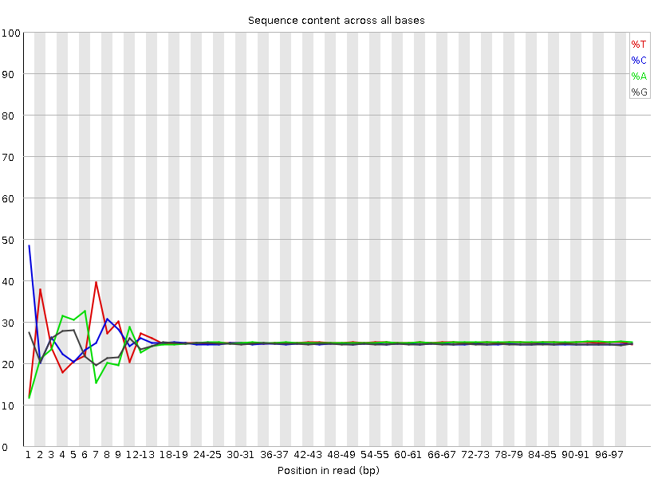

<head>
<script src="https://kit.fontawesome.com/ece750edd7.js" crossorigin="anonymous"></script>
</head>

```{r setup, include=FALSE}
knitr::opts_chunk$set(echo = TRUE)
```

----

## RNA-seq data

Intro on RNA sequencing, technologies, stranded/paired end etc...

----

## 1. Getting Started

We are using the Linux command line to run most of the tools we use today. If you are new to Linux please complete the Intro to Command Line [Workshop](http://bifx-core.bio.ed.ac.uk/hyweldd/training/Bioinformatics_on_the_Command_Line/).

### Logging in
We will use the WCB bioinformatics servers for this practical. If you do not have an account please contact a member of the core facility to get this set up. You will need access to the university network or VPN to access the server.

You will need to use a **Terminal** app on Mac, Linux or Windows or an alternative app such as [MobaXTerm](https://mobaxterm.mobatek.net/). You can also log in via [X2Go](https://wiki.x2go.org/doku.php/doc:installation:start) if you would like to use a graphical interface. 

To login via a command line application:
```bash
ssh USER@bifx-core2.bio.ed.ac.uk
```
Once you have typed in your password, you should see some welcome text and a prompt that looks something like this:

```bash
[USERNAME]@bifx-core2:~$
```

----

### Creating A Web Directory 

In order to view files created on the server, we need to create a *public_html* directory in our home folder.

After logging in you should be in your $HOME directory, check with;
```bash
pwd
```
This should show the PATH of your present working directory, which should now be your home directory as you have just logged in. You can return to this place at any time using the change directory command. 

```bash
cd
```
You have permissions to create files and directories under your home folder. Lets create some now which we will use later on. 

```bash
mkdir ~/public_html
mkdir ~/public_html/TMP
```

Here we have used the absolute path name for each directory using ~/ as a shortcut for your $HOME directory. Nested directories are separated by the forward slash '/' sign. 

As you have created  `~/public_html`, contents of this directory are available online with any web browser 

To see it enter the following URL, changing *yourUserName* to whatever your username is:
https://bifx-core2.bio.ed.ac.uk/~yourUserName

----

### Integrative Genomics Viewer

Please install [IGV](https://software.broadinstitute.org/software/igv/download) on your own machine, alternatively you can use the [web application](https://igv.org/app/).

<div class="key-points">
<h2><i class="fas fa-thumbtack"></i>Key Aims:</h2>
##
 * Make sure you can log in to the bioinformatics server
 * Create a personal web directory
 * Create a project directory for fastq files
 * Install IGV on your own machine
</div>
<br>

----

## 2. RNA-seq sequencing data

The datasets used in this exercise are derived from a single end ChIP-seq experiment (actually ChIP-exo) in *S.cerevisiae*. There are 2 biological replicates (though we recommend using 3 or more!) Reb1_R1 and Reb1_R2 as well as their corresponding input controls Input_R1 and Input_R2. For this experiment immunoprecipitation was performed with antibodies against Reb1. Reb1 recognizes a specific sequence (TTACCCG) and is involved in many aspects of transcriptional regulation by all three yeast RNA polymerases and promotes formation of nucleosome-free regions (NFRs). You can find the original publication [here](http://www.sciencedirect.com/science/article/pii/S0092867411013511). For the purpose of this workshop we have randomly subsampled and filtered out poor quality reads to speed up runtime.

| Dataset | Description |
| ------- | ----------- |
| Reb1_R1 | ChIP experiment, replicate 1 |
| Reb1_R2 | ChIP experiment, replicate 2 |
| Input_R1 | Input DNA, replicate 1 |
| Input_R2 | Input DNA, replicate 2 |

----

### Obtaining data

First, make a new directory for this tutorial and move into that directory. Then link the directory to your `public_html` folder as we are going to make everything public in this tutorial.

```bash
cd 
mkdir RNA-seq_workshop
cd RNA-seq_workshop
ln -s $PWD ~/public_html/
```

Next, create a subfolder called **fastq** for all of our sequence files and link the raw datasets to this folder:

```bash
mkdir fastq
cp /homes/library/training/ChIP-seq_workshop/data/*fq.gz fastq/.
```

When you receive data from a sequencing centre the file should also be provided with an alphanumeric string known as an **md5 checksum**. We can think of this as a files passport or fingerprint and use it to verify our data and ensure it wasn't corrupted or truncated during download. The md5 checksums for these files are below. Lets check that now using the `md5sum` command:

|md5 checksum|filename|
|------------|--------|
|914b4dda687a76b0d50e545e3ce705d6|Input_R1.fq.gz|
|f421ed18b71a801b236612cdde49dbaf|Input_R2.fq.gz|
|dd363301ad237ecb6c81c59ae97995a2|Reb1_R1.fq.gz|
|06623f9e556876dd6c4d1dfdc4348698|Reb1_R2.fq.gz|

```bash
cd fastq #Move into the fastq directory
md5sum *.fq.gz > md5
cat md5 #prints out the contents of md5
#To check the files and md5 sums match at any time
md5sum -c md5 
```

----

### FastQ files

Sequencing data will typically be provided to you in **fastq** format (.fq or .fastq) or as a compressed gzipped fastq (.fq.gz) in order to save space. We can view a gzipped file with the zless command, let's take a look:

```bash
cd RNA-seq_workshop
cd fastq # Move into the fastq directory (if not already)
zless Control_1.fq.gz | head -n 12
```

[Fastq](https://en.wikipedia.org/wiki/FASTQ_format) files contain 4 lines per sequenced read:

* Line 1 begins with an '@' character and is followed by a sequence identifier and an optional description
* Line 2 is the raw sequence
* Line 3 begins with a '+' character and is optionally followed by the same sequence identifier
* Line 4 encodes the Phred quality score for the sequence in Line 2 as ASCII characters

----

## 3. Quality control

Next we want to assess the quality of our sequencing data and check for any biases and contamination. 

----

### FastQ screen

When running a sequencing pipeline it is useful to know that your sequencing library contains the types of sequence they're supposed to. [FastQ Screen](http://www.bioinformatics.babraham.ac.uk/projects/fastq_screen/) allows you to set up a standard set of libraries against which all of your sequences can be searched. Your search libraries might contain the genomes of all of the organisms you work on, along with PhiX, Vectors or other contaminants commonly seen in sequencing experiments. We will run a screen of our sequences against a few default genomes:

```bash
cd .. #Move up a directory again
fastq_screen --conf /homes/genomes/tool_configs/fastq_screen/fastq_screen.conf fastq/*fq.gz --outdir fastq
# * is a wild card character
```
Once complete take a look at the output images in your browser via your public_html folder. This shows that most of your reads align to the human genome and that no reads align uniquely to other organisms:
<!--Update pic here?-->


----

### FastQC

[FastQC](http://www.bioinformatics.babraham.ac.uk/projects/fastqc/) provides simple quality control checks on raw sequence data coming from high throughput sequencing pipelines. It provides a modular set of analyses which you can use to get a quick impression of whether your data has any problems of which you should be aware before proceeding.

```bash
fastqc fastq/*.fq.gz
```
FastQC will create report files for each of your datasets which we can view in the browser. We will go through each of the images during the workshop. For future reference, specific guidance on how to interpret the output of each module is provided in the [fastqc help pages](http://www.bioinformatics.babraham.ac.uk/projects/fastqc/Help/).

An example of poor quality sequencing at the end of short reads:


The software gives a *pass*, *fail* or *warning* flag for each test based on what we would expect from a regular DNA-sequencing run. It is important to realise that FastQC does not understand the origin of your data and that different datasets will have different characteristics. For instance RNA sequencing often involves the use of **random hexamer primers** that are [not as random as you might expect](https://sequencing.qcfail.com/articles/positional-sequence-bias-in-random-primed-libraries/). The profile below in the first ~15 bases is perfectly normal for these samples but will be flagged as an error by FastQC:



Visit the [QCFail](https://sequencing.qcfail.com/author/simon/) website for more examples and advice on quality control for NGS datasets.

----

### MultiQC

We can view summaries of multiple reports at once by using [multiqc](http://multiqc.info/):

```bash
multiqc -o fastq fastq
```

MultiQC searches for report files in a directory and compiles them into a single report. Open the multiqc report via a web browser to see how the raw datasets compare. Here we have the output of FastQ_screen and FastQC, but MultiQC works with the outputs of many tools other tools which we'll see later.

If we look at the *adapter content* and *over represented sequences* sections we can see a small amount of contamination particularly at the ends of the sequencing reads.

----

## 4. Shell scripts, pipelining and parallelisation

Up until now we have run command line tools on each one of our datasets in serial, this means they run one after the other. In this tutorial we only have a few small datasets and the tools run relatively quickly, but this approach won't scale well to multiple large datasets. A more efficient approach is to create a **script** that will run all of our datasets in **parallel**.

----

### parallel

Unix has a program called **parallel** which allows you to run tools on multiple datasets at the same time. The following command would list all of your gzipped fastq files and pipe "|" them into parallel. 

```bash
ls fastq/*fq.gz | parallel -j 5 fastqc {} &
ps f
```

* *ls* lists files ending with .fq.gz in your fastq directory and pipes the names into the parallel command.
* The parallel *-j* flag stands for *juggle* and tells parallel to run 5 processes at the same time. 
* In this case we are running fastqc and the *{}* is a place holder for the filenames we are piping in.
* The *&* character runs these jobs in the background so we can continue to use the terminal.
* *ps* is the *process status* tool which shows jobs running in the current session, we should see 5 instances of fastqc running.

----

### Shell scripts

Putting all of your commands into a script is good practice for keeping track of your analysis and for reproducibility. We want to write scripts so they can be used again on different datasets and avoid *hardcoding* the names of files.

First, let's create a file that lists our sample names so we can feed this into our pipeline. We could just type this manually or use a bit of text processing like the code below, here fastq files are 'piped' into parallel as above but we use regular expression within 'sed' to remove the name ending, this can now be used to name all files.

```bash
ls fastq/*fq.gz | parallel basename | sed s/.fq.gz// > samples.txt
```

Now let's create our pipeline script. We'll start by creating and opening a new file called **pipeline.sh**. The .sh stands for shell which is essentially just a name for the command line environment.

```bash
emacs -nw pipeline.sh
```
**Emacs** is a Unix text editor and the -nw flag opens a new window for editing. Here we are going to paste all of the commands we have used so far (click the mouse wheel to paste in the terminal):

~~~
## PREPARATION

## Create a web directory to view output                         
ln -s $PWD ~/public_html/
## Create a folder for fastq files
mkdir fastq
## Link the raw data to the fastq folder
cp /homes/library/training/RNA-seq_workshop/fastq/*fq.gz fastq/
## Link the annotation folder
ln -s /homes/library/training/RNA-seq_workshop/annotation .

## QC

## FastQ Screen
fastq_screen --conf /homes/genomes/tool_configs/fastq_screen/fastq_screen.conf fastq/*fq.gz --outdir fastq

## FastQC
fastqc fastq/*.fq.gz

##Multi QC
multiqc -o fastq fastq

## PREPROCESSING 
~~~

The **#** symbol indicates a comment line and anything preceded by a # will not be run by the command line. It is good practice to comment your code.

----

### Challenge
<div class="challenge">
<h2><i class="fas fa-pencil-alt"></i> Challenge:</h2>
See if you can adapt the QC portion of the script to use parallel. 

**Hint:** `cat samples.txt` will print the names of all of the samples.
<details>
<summary>
Solution
</summary>
<div class="solution">
<h2><i class="far fa-eye"></i></h2>
`cat samples.txt | parallel -j 5 "fastq_screen --conf /homes/genomes/tool_configs/fastq_screen/fastq_screen.conf fastq/{}.fq.gz  --outdir fastq"`

`cat samples.txt | parallel -j 5 "fastqc fastq/{}.fq.gz"`
</div>
</details>
</div>
<br>

To save and exit the file press **ctrl-x**, followed by **ctrl-c** and then **y** to save.

Let's move on with our RNA-seq analysis. Every time we run a tool that creates new output we should add it to our pipeline.sh file. We will learn how to run this script and the full analysis in one go later on.

Although shell scripts save all of your commands they do not necessarily track the versions of software that you use or the current state of your environment and other tool dependencies. They are also unaware of the workflow of your data. More advanced methods of *pipelining* and *containerisation* are recommended for fully reproducible analysis and sustainable programming and we will see an example of this using **NextFlow** in the next session.

----

## 5. Pre-processing: Quality trimming and adapter removal

From the FastQC report we can see that the overall quality of our sequencing is good, however it is good practice to perform some pre-processing and filtering of reads. Poor quality sequencing can make a read less alignable, so it is good practice to **quality trim** the ends of reads until we get to the high quality portion. Trimming is not always necessary as some mapping programs will trim the reads for you or perform **soft clipping** where only part of a read is required to align, but studies have shown that pre-processing generally improves alignment rate if done correctly. 

Sequencing libraries are normally constructed by ligating adapters to fragments of DNA or RNA. If your read length is longer than your fragment then [sequenced reads will contain the adapter sequence](https://sequencing.qcfail.com/articles/read-through-adapters-can-appear-at-the-ends-of-sequencing-reads/). **Adapter removal** is a necessary consideration for your QC workflow, especially if adapters are detected by FastQC.

An example of adapter contamination at the end of reads:


Once reads have been trimmed they will vary in length. You may want to **filter** out reads that are now too short to be uniquely mapped. Normally a cutoff of 20-30bp is standard.

----

### Trim Galore!

In this workshop we will use [Trim Galore!](https://www.bioinformatics.babraham.ac.uk/projects/trim_galore/) for adapter and quality trimming. It is a wrapper around the popular tool [Cutadapt](http://cutadapt.readthedocs.org/en/stable/index.html) which finds and removes unwanted sequences from high-throughput sequencing reads. 

Cutadapt can perform quality trimming, adapter removal and read filtering as well as many other operations to prepare your reads for optimal alignment. We will run **trim galore!** with the following parameters:

* -q : Trim reads from the 3' end with the given quality threshold (Phred score)
* --length : Filter out reads below this length
* --fastqc : Run fastqc on the trimmed reads
* --illumina : Trim the standard Illumina adapter sequences
* --cores : Use multiple CPU cores to speed up the computation
* -o : the name of the output folder

<div class="blue">
```bash
mkdir trim_galore ## Create a new folder for trimmed data
cat samples.txt | parallel -j 5 "trim_galore --fastqc -q 20 --illumina --length 20 --cores 4 -o trim_galore fastq/{}.fq.gz"
```
</div>

To view a trim_galore report:
```bash
less trim_galore/Control_1.fq.gz_trimming_report.txt
```

Let's compare the fastqc reports. Run **multiqc** on the trimmed data and compare this with the reports for the raw data.

<div class="blue">
```bash
multiqc -f -o trim_galore trim_galore
```
</div>

Remember to add the trim_galore and multiqc steps to your **pipeline.sh** file.

----

### Other trimming software worth investigating 

Trim Galore simplifies the Cutadapt command and also runs fastqc on the trimmed data. However, it is worth looking through the full functionality of Cutadapt which has many options for filtering and trimming reads. **Trimmomatic** is another tool which has a very sensitive algorithm for detecting adapters, especially in paired-end reads.

* [Cutadapt](https://cutadapt.readthedocs.io/en/stable/)
* [Trimmomatic](http://www.usadellab.org/cms/?page=trimmomatic) 

### Further QC steps

It may be worth looking into a few other tools for quality control of RNA-seq data.

* [SortMeRNA](https://bioinfo.lifl.fr/RNA/sortmerna/) can remove sequences that map to ribosomal RNAs. Ideally, your library preparation should include steps to deplete ribosomal RNAs but you can also use tools to remove these from your analysis.
* [RSeQC](http://rseqc.sourceforge.net/) is a QC tool specifically for RNA-seq.

<div class="key-points">
<h2><i class="fas fa-thumbtack"></i>Key Aims:</h2>
##
 * Check for contaminants
 * Assess sequence quality
 * Understand scripting
 * Trim and filter your sequencing reads
</div>

----

## 6. Read Alignment

There are many tools available for mapping reads to genomes and transcriptomes, each with their own purposes and strengths. RNA-seq data requires a *splice-aware* aligner that can handle splice junctions in the sequencing reads. The two most popular aligners are [STAR](https://github.com/alexdobin/STAR), which is very fast, and  [HISAT2](http://daehwankimlab.github.io/hisat2/manual/), which is very accurate.


### Genome assemblies and indexing

First, we need to select a reference genome to align to. Every time a reference genome is released or updated it is given a new name, often referred to as the genome build or assembly (..hg18, hg19, hg38). It is important to realise that different builds of the same genome are different sequences and thus their co-ordinate systems are incomparable. For instance position 10000000 on chr1 is T in hg19 and G in hg38. 

We are going to map our reads to the latest release of the human genome (**hg38** or **GRCh38**). We need to create an index file from the GRCh38 fasta sequence so that STAR can quickly access the reference sequences. Many of these indexes are pre-computed on our servers and stored under the /homes/genomes directory for everyone to use. The indexes for this workshop have are available at **.

The code below shows how these were generated with STAR. You do not need to run this again. 
```bash
## Download sequence files and latest annotations from Ensembl
#wget http://ftp.ensembl.org/pub/release-106/fasta/homo_sapiens/dna/Homo_sapiens.GRCh38.dna.primary_assembly.fa.gz  ## Use primary assembly without Alt contigs but including scaffolds
#wget http://ftp.ensembl.org/pub/release-106/gtf/homo_sapiens/Homo_sapiens.GRCh38.106.gtf.gz

#gzip -d Homo_sapiens.GRCh38.dna.primary_assembly.fa.gz
#gzip -d Homo_sapiens.GRCh38.106.gtf.gz

## Build STAR index
#STAR --runMode genomeGenerate --genomeDir STAR_index_hg38.ensembl106 --genomeFastaFiles Homo_sapiens.GRCh38.dna.primary_assembly.fa --sjdbGTFfile Homo_sapiens.GRCh38.106.gtf --sjdbOverhang 100 --runThreadN 20
```

### Mapping reads with STAR

Now that we have an index we can align our reads to the human genome with STAR.

<div class="blue">
```bash
mkdir STAR ## make a new folder for read alignments
cat samples.txt | parallel -j 5 "STAR --genomeDir annotation/STAR_index_hg38.ensembl106 --readFilesCommand zcat --readFilesIn sub/trim_galore/{}_trimmed.fq.gz --runThreadN 4 --outSAMtype BAM SortedByCoordinate --outFileNamePrefix sub/STAR/{}. --sjdbGTFfile annotation/Homo_sapiens.GRCh38.106.gtf --outWigType wiggle --outWigNorm RPM"
```
</div>

We are using the following parameters:

* --genomeDir : The location of the STAR genome index
* --readFilesInCommand : The unix command for reading a *.gz file
* --readFilesIn : The location of the fq.gz file
* --runThreadN : The number of CPU threads available to each STAR process
* --outSAMtype : The output file format
* --outFileNamePrefix : Used to name the outputs
* --sjdbGTFfile : A gene model and splice junction annotation file in gtf format
* --outWigType : Additional output of read coverage profile
* --outWigNorm : Normalisation strategy for read coverage profile

Note that we do not need to include the --sjdbGTFfile here as it was already used in creating the index. We can provide the annotations at either step or provide a different file with additional annotation.

We recommend reading the [STAR manual](https://github.com/alexdobin/STAR/blob/master/doc/STARmanual.pdf) to fully understand all of the parameters and output options. Running alignment software with default parameters may not be the best option for your data.

When your alignment has completed, take a look at the output STAR report:

```bash
less STAR/Control_1.Log.final.out
```
* How many aligned reads do you have?
* How many of these align to a single location on the genome?
* How many reads map to multiple locations?

### SAM/BAM/CRAM format and Samtools

The standard output for most mapping software is SAM (sequence alignment/map format). SAM files contain many columns that describe the position of each alignment as well as information on the quality of the alignment, mismatches, the number of times a read mapped, mapping of paired ends and other custom flags and statistics. SAM files can be very large so there are compressed alternatives BAM and CRAM. The [samtools](http://www.htslib.org/doc/samtools.html) package has many useful tools for viewing, filtering and manipulating files in SAM format. We will use some of these below.

Take a look at the [SAM format specification](https://samtools.github.io/hts-specs/SAMv1.pdf) and the first few lines of your BAM output using `samtools`.

```bash
samtools view STAR/Control_1.Aligned.sortedByCoord.out.bam | less
```
The second column is the **SAM flag** and contains coded information about each alignment. Use the [Explain SAM flags](https://broadinstitute.github.io/picard/explain-flags.html) resource to find out more about the alignments in your file.

We can also see the samtools header using the -h flag which contains information on the parameters and indexes used to create the file.

```bash
samtools view -h STAR/Control_1.Aligned.sortedByCoord.out.bam | less
```
We can index our bam file for quick programmatic access to the binary file. The file *STAR/Control_1.Aligned.sortedByCoord.out.bam.bai* is created and is essential for some of the samtools programs to work (also for genome browsers).

<div class="blue">
```bash
cat samples.txt | parallel -j 5 "samtools index STAR/{}.Aligned.sortedByCoord.out.bam" ## Index the bam files
```
</div>

The command `samtools idxstats` outputs the number of reads aligned to each sequence in our reference.

```bash
samtools idxstats STAR/Control_1.Aligned.sortedByCoord.out.bam
```

<div class="discussion">
<h2><i class="far fa-bell"></i> Discussion</h2>
The third column represents the number of alignments reads. What can you assume from the alignments to the Y chromosome?
</div>
<br>

----

## 7. Post alignment processing

### Filtering reads with samtools

Now that we have aligned our reads we may want to do some filtering before any downstream analysis. Make sure you are aware of the alignments that are reported by your mapping program and the parameters used. For instance, are unmapped reads included in the BAM file? Are all alignments to repeats reported or just one? Are paired-end alignments still reported if only one end maps?

There are many ways to filter your BAM files with samtools and other programs to remove unwanted alignments that may negatively affect your downstream analysis. First lets look at the alignments contained in one of our bam files with `samtools flagstat`:

```bash
samtools flagstat STAR/Control_1.Aligned.sortedByCoord.out.bam
```

Flagstat seems to report more alignments than the number of reads shown in our STAR report, how can this be? Our BAM file contains 1 record per alignment and some reads may align to multiple locations. We can use samtools view -f to include, and -F to exclude reads with a given SAM flag. 

The flag 260 is the sum of 4 (read is unmapped) and 256 (not primary alignment) to give us only primary alignments. STAR assigns one of the top scoring alignments per read as primary. The `-b` option tells samtools view to output in BAM format.

<div class="blue">
```bash
cat samples.txt | parallel -j 5 "samtools view -F 260 -bh -o  STAR/{}.primary.bam STAR/{}.Aligned.sortedByCoord.out.bam; samtools index STAR/{}.primary.bam"
```
</div>

If we run `samtools flagstat` on this filtered bam file we should now have one alignment per mapped read.

```bash
samtools flagstat STAR/Control_1.primary.bam
```

### Multimap reads and Duplicate reads

Multimap and duplicate reads are often confused so it is important to understand what these are and how they affect your data:

* **Multimap reads** = The read exists once in your library and aligns to multiple repeat locations in the reference genome.
* **Duplicate reads** = Multiple unique reads with the same sequence that align to identical locations in the genome. 


**Multimap reads** are difficult to analyse as their ambiguity can confound results. Many applications require the use of **unique** alignments only, thus multimap reads need to be removed from your BAM file. Aligners assign a **mapping quality** to each read (column 5 in BAM) between 0 and 255 that describes its confidence in the alignment position. Assigned [mapping qualities differ between mappers](https://sequencing.qcfail.com/articles/mapq-values-are-really-useful-but-their-implementation-is-a-mess/). STAR uses mapping quality scores of 0 and 255 to represent multimap and unique reads respectively. Filtering out reads with a mapping quality < 255 means that all remaining reads align to a single unique position. We can use `samtools view -q` to filter based on mapping quality.

<div class="blue">
```bash
cat samples.txt | parallel -j 4 "samtools view -b -q 20 STAR/{}.primary.bam -o STAR/{}.unique.bam; samtools index STAR/{}.unique.bam"
```
</div>

**Duplicate reads** are often observed as tall spikes in your read depth profile where reads are stacked directly on top of each other. A high level of duplication in your library may be due to over amplification by PCR or contamination. In RNA-seq experiments the chances of selecting identical sequences are much higher as our sample size is much smaller (length of transcriptome vs length of genome) and multiple copies of the same sequence (transcripts) exist independently. Thus, it is common practice to retain duplicate reads.

<div class="resources">
<h2><i class="fas fa-book"></i> Further Learning</h2>
Learn more about duplication and removing duplicate reads:

* [Duplication bias](https://sequencing.qcfail.com/articles/libraries-can-contain-technical-duplication/)
* The [Picard](https://broadinstitute.github.io/picard/index.html) package has many useful utilities for manipulating SAM/BAM files. The **MarkDuplicates** tool will check the alignment positions for duplicate reads and mark or remove them from your data depending on how you wish to treat them.
</div>
<br>

### Removing alignments to regions of the genome

In some cases you may wish to remove reads that align to specific regions of the genome. For instance, if you still have a lot of ribosomal RNAs that will skew your downstream analysis.

* [bedtools intersect](https://bedtools.readthedocs.io/en/latest/content/tools/intersect.html) can remove reads from BAM files that align to specific genomic locations.

<div class="key-points">
<h2><i class="fas fa-thumbtack"></i>Key Aims:</h2>
##
 * Align reads to a reference genome
 * Understand key file formats
 * Filter alignments for further analyses
</div>
<br>

----

## 8. Visualising alignments on a genome browser

Visually inspecting data via a genome browser is often the first step in any analysis. Has the sequencing worked as expected? Are there noticeable differences between my samples by eye? Do RNA-seq reads align to the expected strand? 

### Converting BAM files to bigWig

BAM files contain information about each read, which can be great if you want to look at individual alignments and splice junctions, but they are typically large and slow to work with on a genome browser. If we are only interested in read coverage we can convert our BAM files to graphs of sequencing depth per base. 

The **wiggle** file format has three columns to represent genomic co-ordinates and a 4th as a score which will represent the number of reads overlapping that region. A compressed version of this format, called [**bigWig**](https://genome.ucsc.edu/goldenPath/help/bigWig.html), exists for use with genome browsers. 

You will have noticed that we already asked STAR to output wiggle files which are normalised to read depth (RPM = Reads per million bases). STAR gives us wiggle files for both unique and unique + multimap reads and also splits these up by strand. Let's take a look at one of these files:

```bash
head STAR/Control_1.Signal.Unique.str1.out.wig
```
Let's convert the **unique** files to bigWig format for visualisation. The tool **wigToBigWig** requires three arguments, an input file, a file of chromosome lengths, and the name of the output file.

<div class="blue">
```bash
mkdir visualisation ## Create a folder for visualisation files
cat samples.txt | parallel -j 5 "wigToBigWig STAR/{}.Signal.Unique.str1.out.wig annotation/Homo_sapiens.GRCh38.dna.primary_assembly.len visualisation/{}.unique.r.bw; wigToBigWig full/STAR/{}.Signal.Unique.str2.out.wig annotation/Homo_sapiens.GRCh38.dna.primary_assembly.len full/visualisation/{}.unique.f.bw"
```
</div>

<div class="resources">
<h2><i class="fas fa-book"></i> Further Learning</h2>
If you would like to create *bigWig* files directly from BAM files, e.g. after filtering or from other aligners, we recommend using [deepTools bamCoverage](https://deeptools.readthedocs.io). **bamCoverage** has lots of options for filtering, smoothing and normalising read coverage profiles.

Some analysis pipelines use [genomeCoverageBed](https://bedtools.readthedocs.io/en/latest/content/tools/genomecov.html) but be aware that this may not output normalised values.
</div>
<br>


### Viewing data on IGV

----

## 9. Quantifying expression levels

Once we have inspected our data and are happy with our alignments, we can quantify expression levels for annotated transcripts. Pseudo-alignment tools, such as [Salmon](https://salmon.readthedocs.io/en/latest/salmon.html), map sequencing reads directly to transcripts. They are extremely fast, can handle multi-map reads, and take into account multiple isoforms, transcript lengths and sequencing biases when estimating abundance. 

----

### Create a Salmon index

Like STAR, Salmon requires an index for alignment. The indexes require fasta sequences of all coding and non-coding RNAs as well as the genomic sequence. The Salmon index for this workshop has been pre-computed using the code below. It will also be in the annotation folder you linked previously.

```bash
## Download cdna and ncrna fasta files from Ensembl
#wget http://ftp.ensembl.org/pub/release-106/fasta/homo_sapiens/cdna/Homo_sapiens.GRCh38.cdna.all.fa.gz
#wget http://ftp.ensembl.org/pub/release-106/fasta/homo_sapiens/ncrna/Homo_sapiens.GRCh38.ncrna.fa.gz

## Create Salmon indexes

## Concatenate hg38 cdna and ncrna
#zcat Homo_sapiens.GRCh38.cdna.all.fa.gz Homo_sapiens.GRCh38.ncrna.fa.gz > Homo_sapiens.GRCh38.cdna.ncrna.fa.tmp

## Make sure header is transcript name only and remove transcript version number
#perl -lane 'if(m/^>/){$id=(split " ",$_)[0];$id=(split "\\.",$id)[0];print $id;}else{print $_;}' Homo_sapiens.GRCh38.cdna.ncrna.fa.tmp  > Homo_sapiens.GRCh38.cdna.ncrna.fa
#rm Homo_sapiens.GRCh38.cdna.ncrna.fa.tmp

## Get genome chr sequences in decoys.txt
#grep "^>" Homo_sapiens.GRCh38.dna.primary_assembly.fa | sed s/">"//g | cut -f 1 -d " " > decoys.txt

## Cat transcriptome and genome to make gentrome file: 
#cat Homo_sapiens.GRCh38.cdna.ncrna.fa Homo_sapiens.GRCh38.dna.primary_assembly.fa > Homo_sapiens.GRCh38.cdna.ncrna.gentrome.fa
#gzip Homo_sapiens.GRCh38.cdna.ncrna.gentrome.fa

## Build Salmon index
#salmon index -t Homo_sapiens.GRCh38.cdna.ncrna.gentrome.fa.gz -d decoys.txt -p 24 -i hg38.cdna.ncrna.salmon.index -k 31
```

<div class="resources">
<h2><i class="fas fa-book"></i> Further Learning</h2>
Creating Salmon indexes is more complicated than STAR but the bioinformatics team can help you out if you need to do this. You can also read more about the method [here](https://combine-lab.github.io/alevin-tutorial/2019/selective-alignment).
</div>
<br>

### Pseudo-alignment with Salmon

We can now run Salmon to estimate expression levels of transcripts. We use the `salmon quant` command with the following arguments:

* -i : location of the index files
* -r : location of the fq.gz file (use -1,-2 for paired end files)
* -l : library type (read the docs to see what this means)
* --seqBias : correct sequencing bias in the data 
* --gcBias : correct GC bias in the data
* -o : name of the output folder

<div class="blue">
```bash
mkdir salmon ## Make a folder for salmon output
cat samples.txt | parallel -j 5 "salmon quant -i annotation/hg38.cdna.ncrna.salmon.index -l SR -r trim_galore/{}_trimmed.fq.gz -p 5 --seqBias --gcBias -o salmon/{}"
```

Biases in sequencing data can lead to over/under estimation of expression of certain transcripts. As you can see, Salmon has some functionality to overcome this.

The main output of Salmon is a *quant.sf* file, take a look at one of these files:
```bash
less salmon/Control_1/quant.sf
```

For each transcript we have five columns:

* The transcript identifier
* The transcript length (in bp)
* The effective length (described in detail below)
* TPM (transcripts per million), which is computed using the effective length
* The estimated read count (‘pseudocount’)

<div class="discussion">
<h2><i class="far fa-bell"></i> Discussion</h2>
What exactly is the effective length?
The sequence composition of a transcript affects how many reads are sampled from it. While two transcripts might be of identical actual length, depending on the sequence composition we are more likely to generate fragments from one versus the other. The transcript that has a higer likelihood of being sampled, will end up with the larger effective length. The effective length is the transcript length which has been “corrected” to include factors due to sequence-specific and GC biases.
</div>
<br>

### 9. Finish your script 

We now have our alignments (BAM), visualisation files (bigWig) and transcript quantification (quant.sf) and this is normally a branching point for downstream analyses.  

Your pipeline.sh script should look something like [this](http://bifx-core.bio.ed.ac.uk/training/ChIP-seq_workshop/pipeline.sh) and we can run everything from start to end in one go. This could take....

```bash
mkdir RNA-seq_workshop_tmp #Create a temporary directory
cd  RNA-seq_workshop_tmp #Move into that directory
cp ../pipeline.sh ../samples.txt . #Copy the pipeline and samples file into the new directory
ln -s ../annotation . #Link the annotation folder to this new directory
bash pipeline.sh > pipeline.log & #Run the shell script (See Below)
cd .. #Move back to the main directory
```

* We use the unix tool **bash** and the name of our script to run our commands through the shell. 
* We then redirect **>** the output to a log file to keep track of any errors.
* We use the **&** to run everything in the background to continue using the terminal.

You can keep track of your pipeline by using **ps** or looking at the log file.

```bash
ps f
tail RNA-seq_workshop_tmp/pipeline.log #Shows the end of a file
```

----

### Tidy Up! 
Files are large and disk space is expensive, remove any unwanted or temporary files from your folder. We should always keep the raw data (fastq) and our final processed datasets (BAM, bigWig etc) and the script we used to generate them. Where you can, convert files to compressed or binary formats to save space e.g. fq to fq.gz, SAM to BAM, wig to bigWig.
 
<div class="blue">
```bash 
rm trim_galore/*trim*fq.gz #Remove trimmed fastq temporary files
rm STAR/*/*.wig #Remove wig files once converted to bigWig
```
</div>


